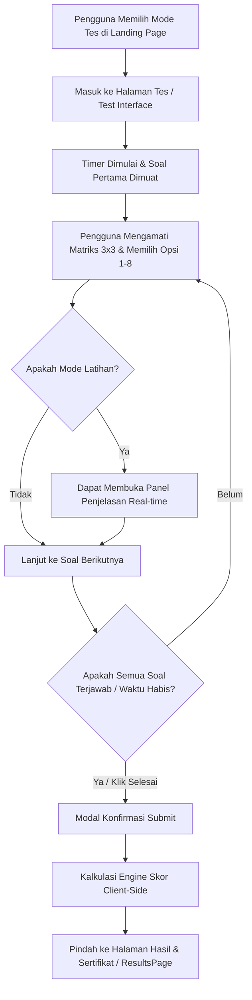

# Product Requirements Document (PRD)
## Halaman Asesmen Tes IQ (Test Interface Page) — NeuroMatrix Labs

---

### 1. Ikhtisar Produk (Product Overview)
**NeuroMatrix Labs Test Interface** adalah modul utama tempat pengguna melakukan tes kecerdasan murni (*General Fluid Intelligence / g-factor*) secara digital. Modul ini menyajikan instrumen matriks progresif berbasis prinsip **Raven’s Progressive Matrices (RPM)** yang *Culture-Fair* dan terkalibrasi dengan **Skala Wechsler (Mean = 100, SD = 15)**.

Asesmen dijalankan menggunakan arsitektur **Zero-Trace Client-Side Engine**, di mana seluruh kalkulasi latensi jawaban, evaluasi logika, dan estimasi skor dieksekusi 100% di dalam browser pengguna (perangkat lokal) tanpa paywall dan tanpa penyimpanan database cloud eksternal.

---

### 2. Tujuan & Objektif Utama (Goals & Key Objectives)
1. **Presisi Psikometrik**: Menyajikan butir soal matriks 3x3 yang menguji penalaran deduktif, diferensiasi spasial, rotasi, kalkulasi Boolean visual (XOR/AND/OR), dan interpolasi deret.
2. **Pengalaman Pengguna Tanpa Distraksi (Distraction-Free UX)**: Antarmuka yang bersih, modern, dan responsif di desktop maupun perangkat seluler (mobile-first layout).
3. **Fleksibilitas Protokol Asesmen**: Menyediakan 3 pilihan mode tes yang disesuaikan dengan kebutuhan pengguna (Tes Standar Klinis, Mode Kilat Mobile, dan Mode Latihan Bebas).
4. **Transparansi & Keamanan Data (Zero-Trace)**: Tidak memerlukan login, kartu kredit, atau pelacak pihak ketiga. Seluruh state asesmen diproses dalam memory browser.

---

### 3. Persona Pengguna (Target User Personas)
* **Peserta Sertifikasi Mandiri**: Pengguna umum yang membutuhkan pengukuran kapasitas logika objektif dan sertifikat resmi tanpa paywall.
* **Akademisi & Peneliti**: Individu yang membutuhkan instrumen tes terstandarisasi yang terbebas dari bias budaya dan akademis.
* **Pengguna Perangkat Seluler (Mobile User)**: Pengguna yang mengerjakan tes melalui HP/tablet dengan alokasi waktu singkat (Mode Kilat 6 Menit).

---

### 4. Fitur Utama & Spesifikasi Fungsional (Core Functional Requirements)

#### 4.1 Parameter & Pilihan Mode Tes (Test Modes)
| Parameter | Tes Standar Klinis | Mode Kilat Mobile | Mode Latihan Bebas |
| :--- | :--- | :--- | :--- |
| **Jumlah Soal** | 30 Item Matriks | 8 - 18 Item IRT | 30 Item Matriks |
| **Alokasi Waktu** | 12 Menit (720 Detik) | 6 Menit (360 Detik) | Tanpa Batas Waktu |
| **Tujuan** | Sertifikasi Presisi Tinggi (r = 0.91) | Estimasi Cepat Mobile | Pemahaman Pola Logika |
| **Sertifikat PDF** | Ya (Dengan Verification QR & SHA-256) | Ya (Versi Ringkas) | Tidak (Hanya Latihan) |
| **Penjelasan Jawaban** | Setelah Tes Selesai | Setelah Tes Selesai | Langsung (*Real-time Toggle*) |

#### 4.2 Komponen Antarmuka Tes (Interface Layout Components)
1. **Header Control Bar (Bilah Navigasi Atas)**:
   - **Mode Badge**: Label penanda mode yang sedang aktif (*"Tes Standar Klinis 12m"*, *"Mode Kilat 6m"*, *"Mode Latihan"*).
   - **Live Countdown Timer**: Penghitung waktu mundur dengan animasi indikator warna (Hijau `#005f40` → Kuning `#D97706` → Merah `#DC2626` saat sisa waktu < 2 menit).
   - **Progress Counter**: Menampilkan indikator progress soal (misal: *"Soal 12 dari 30"*).
   - **Tombol Batalkan Tes (Emergency Quit)**: Memicu dialog konfirmasi sebelum membatalkan sesi.

2. **Kanvas Matriks Utama (Matrix Puzzle Canvas)**:
   - Menyajikan matriks 3x3 dengan 8 elemen terisi dan 1 slot kosong (Tile `?` / slot jawaban).
   - Diberdayakan oleh komponen **MatrixCellSVG** resolusi tinggi yang mendukung kontras tajam dan rendering vektor geometris murni.

3. **Kisi Pilihan Jawaban (Option Selection Grid)**:
   - Menyajikan 6 hingga 8 kartu pilihan bentuk geometri (opsi A hingga H / 1 hingga 8).
   - Kartu responsif dengan status *hover*, *active selection ring* berwarna emerald (`#005f40`), dan umpan balik haptik/visual langsung.
   - Mendukung navigasi *shortcut keyboard* (Tombol angka `1`–`8` untuk memilih opsi).

4. **Bilah Navigasi & Palet Soal (Question Palette & Nav Toolbar)**:
   - **Tombol Sebelum / Sesudah**: Navigasi antar butir soal tanpa kehilangan jawaban yang telah dipilih.
   - **Palet Kisi Soal (Item Grid Jumper)**: Menampilkan status seluruh nomor soal:
     - *Sudah dijawab*: Warna hijau soft dengan centang.
     - *Belum dijawab*: Warna netral border slate.
     - *Sedang dibuka*: Ring aktif emerald.
   - **Tombol Selesaikan Tes**: Memicu modal konfirmasi submit tes atau otomatis submit jika waktu habis.

5. **Panel Penjelasan Mode Latihan (Practice Explanation Drawer)**:
   - Tersedia khusus pada Mode Latihan.
   - Menyediakan tombol *"Lihat Kunci & Logika Pola"* yang membuka panel penjelasan transparan mengenai aturan rotasi, kalkulasi bentuk, atau relasi spasial pada soal tersebut.

---

### 5. Alur Pengguna (User Flow)

---

### 6. Persyaratan Non-Fungsional (Non-Functional Requirements)

* **Performa & Aksesibilitas**:
  - *Load Time*: Soal dan modul SVG dirender instan (< 100ms per switch soal).
  - *Keyboard Shortcut*: Tombol `1`–`8` untuk opsi jawaban, `Arrow Left` / `Arrow Right` untuk navigasi soal.
  - *Responsive Design*: Tampilan mulus pada resolusi layar mobile (320px) hingga desktop ultra-wide.
* **Keandalan Timer**: Timer menggunakan ref timestamp interval untuk mencegah kelemahan throttling di background tab browser.
* **Keamanan & Privasi**: Zero-trace, tidak ada data jawaban yang dikirim ke server cloud eksternal.

---

### 7. Kriteria Keberhasilan (Acceptance Criteria)
1. Seluruh 30 soal matriks dapat ditampilkan dengan garis vektor tajam tanpa pikselasi.
2. Pengguna dapat memilih jawaban, berpindah nomor soal, dan mengubah pilihan kapan saja sebelum tes diselesaikan.
3. Saat timer mencapai `00:00`, tes secara otomatis melakukan *auto-submit* jawaban yang ada dan mengarahkan pengguna ke halaman hasil.
4. Tampilan visual mengikuti sistem desain NeuroMatrix Labs (Emerald `#005f40`, Slate `#F1F4F9`, Inter Font).
