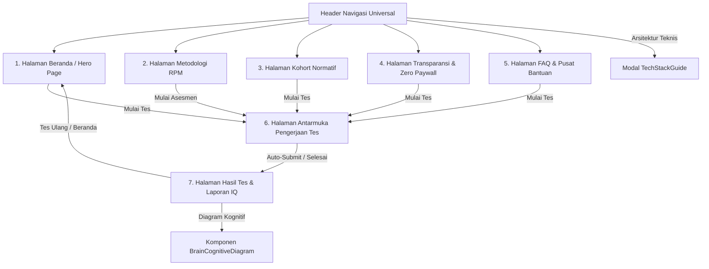

# Product Requirements Document (PRD)
## Platform Asesmen Psikometri & Tes IQ — NeuroMatrix Labs

---

### 1. Ikhtisar Produk (Product Overview)
**NeuroMatrix Labs** adalah platform laboratorium asesmen psikometri komputasional berstandar akademis yang menyediakan layanan pengujian kecerdasan murni (*General Fluid Intelligence / g-factor*) secara digital. Platform ini mengadopsi instrumen **Raven's Progressive Matrices (RPM)** yang *Culture-Fair* dan distandarisasi menggunakan **Skala Wechsler (Mean = 100, Standar Deviasi SD = 15)**.

Platform ini mengusung filosofi **Zero Paywall & Zero-Trace Client-Side Engine**, di mana 100% proses pengujian, kalkulasi skor, analisis domain kognitif, serta pembuatan sertifikat PDF resolusi tinggi dieksekusi secara lokal di dalam browser pengguna (WebAssembly/React Client State) tanpa memerlukan registrasi akun, tanpa meminta informasi pembayaran, dan tanpa menyimpan data pribadi ke server eksternal.

---

### 2. Peta Halaman & Arsitektur Sistem (Platform Architecture & Page Map)

Platform NeuroMatrix Labs terdiri dari **7 Halaman Utama (Views)** dan **2 Modul Overlay**:

---

### 3. Detail Spesifikasi 7 Halaman Utama (Detailed Page Specifications)

#### 3.1 Halaman Beranda (Hero / Home Page) — `Hero.tsx`
* **Tujuan**: Memperkenalkan platform NeuroMatrix Labs, menyajikan opsi pemilihan mode tes, serta menampilkan riwayat hasil tes sebelumnya yang tersimpan di *local storage*.
* **Komponen Utama**:
  * *Hero Banner*: Judul utama, subtitle penjelasan validitas RPM & Wechsler, badge status engine aktif.
  * *Kartu Pemilihan Mode Tes*:
    1. **Tes Standar Klinis (12 Menit, 30 Soal)**: Mode terkalibrasi presisi tinggi ($r = 0.91$).
    2. **Mode Kilat Mobile (6 Menit, 18 Soal)**: Estimasi cepat terkalibrasi Item Response Theory (IRT).
    3. **Mode Latihan Bebas (Untimed)**: Latihan penalaran induktif dengan penjelasan logika real-time.
  * *Panel Riwayat Tes (Test History Drawer)*: Menampilkan hingga 10 hasil tes sebelumnya dari `localStorage` beserta skor IQ, persentil, dan tanggal pengerjaan.

#### 3.2 Halaman Metodologi RPM (RPM Methodology Page) — `RpmMethodologyPage.tsx`
* **Tujuan**: Menjelaskan landasan ilmiah di balik instrumen Raven's Progressive Matrices, validitas *g-factor*, dan teori Item Response Theory (IRT).
* **Komponen Utama**:
  * *Prinsip Culture-Fair*: Penjelasan mengapa matriks visual geometris terbebas dari bias bahasa, kultur, dan tingkat pendidikan formal.
  * *Matriks Distribusi Kesukaran*: Penjelasan pembagian 3 tingkat kesulitan item (Mudah, Sedang, Kompleks).
  * *Buku Putih Validitas Psikometri*: Parameter korelasional dengan tes WAIS-IV ($r = 0.82$).

#### 3.3 Halaman Kohort Normatif (Normative Cohort Page) — `NormativeCohortPage.tsx`
* **Tujuan**: Memvisualisasikan distribusi statistik IQ populasi dunia berbasis Skala Wechsler (Mean = 100, SD = 15).
* **Komponen Utama**:
  * *Grafik Kurva Gauss Interaktif (Gaussian Bell Curve)*:
    * Animasi SVG garis kurva mengalir dari kiri ke kanan.
    * Nilai persentil populasi terpeta: **2.2%** (SD < -2 / < 70), **13.6%** (70-85), **68.2%** (Rata-rata 85-115), **13.6%** (115-130), **2.2%** (Superior > 130).
  * *Penghitung Angka Real-Time (Number Counter Animation)*: Menghitung persentil dari 0% hingga angka target saat halaman dimuat.

#### 3.4 Halaman Transparansi & Zero Paywall (Transparency Page) — `TransparencyPage.tsx`
* **Tujuan**: Mengedukasi pengguna mengenai perbedaan arsitektur NeuroMatrix Labs dengan situs tes IQ komersial yang menjebak pengguna (*dark patterns* / paywall).
* **Komponen Utama**:
  * *Tabel Komparasi Fitur*: Membandingkan *Situs Komersial Umum* (berbayar Rp 99k-350k, simpan data iklan) vs *NeuroMatrix Labs* (100% gratis, zero-trace client-side).
  * *Pernyataan Keamanan Data Zero-Trace*: Jaminan bahwa data jawaban diolah di memori lokal browser tanpa pixel pelacak pihak ketiga.

#### 3.5 Halaman FAQ & Pusat Bantuan (FAQ & Help Center Page) — `FaqPage.tsx`
* **Tujuan**: Menyediakan jawaban lengkap atas pertanyaan umum seputar pelaksanaan tes, verifikasi sertifikat, dan metodologi.
* **Komponen Utama**:
  * *Search Bar Dynamic*: Fitur pencarian kata kunci dengan indikator shortcut `ESC untuk reset`.
  * *Pill Filter Kategori*: Filter berdasarkan *Semua*, *Pelaksanaan*, *Skor & Sertifikasi*, *Metodologi*, dan *Privasi*.
  * *Accordion Interaktif*: Pertanyaan dan jawaban tertutup secara default saat dimuat, dapat dibuka-tutup dengan transisi halus.
  * *Bento Support Card*: Kartu kontak tim peneliti (`mailto:support@neuromatrix.id`).

#### 3.6 Halaman Antarmuka Pengerjaan Tes (Test Interface Page) — `TestInterface.tsx`
* **Tujuan**: Modul utama pengerjaan tes tempat pengguna menjawab soal matriks 3x3.
* **Komponen Utama**:
  * *Header Control Bar*: Timer mundur (12m/6m), penunjuk progress nomor soal ($X/N$), tombol batalkan tes.
  * *Kanvas Matriks 3x3 (MatrixCellSVG)*: Visualisasi soal matriks geometris 3x3 dengan 1 tile kosong `?`.
  * *Kisi Opsi Jawaban (6-8 Opsi)*: Kartu responsif untuk memilih jawaban dengan dukungan shortcut keyboard `1`–`8`.
  * *Palet Navigasi Soal (Item Jumper)*: Kisi tombol nomor 1–30 yang menandai status soal (*terjawab*, *sedang aktif*, *belum dijawab*).
  * *Panel Penjelasan Mode Latihan*: Toggle untuk melihat aturan pola logika secara langsung pada Mode Latihan.

#### 3.7 Halaman Hasil Tes & Laporan IQ (Results Page) — `ResultsPage.tsx`
* **Tujuan**: Menampilkan laporan hasil tes IQ komprehensif setelah asesmen diselesaikan.
* **Komponen Utama**:
  * *Skor IQ Wechsler & Persentil Populasi*: Menampilkan angka IQ (misal: 128), rentang klasifikasi (Superior), dan posisi persentil (misal: 97%).
  * *Breakdown 4 Domain Kognitif*: Penalaran Induktif, Delineasi Visual-Spasial, Penalaran Analitis, dan Kecepatan Pemrosesan Logika.
  * *Komponen BrainCognitiveDiagram*: Visualisasi diagram otak interaktif.
  * *Generator Sertifikat PDF Terverifikasi*: Tombol unduh sertifikat PDF resmi lengkap dengan QR Code Verifikasi dan SHA-256 Checksum Hash.

---

### 4. Fitur Universal & Navigasi (Global Layout & Controls)

1. **Header Universal (`Header.tsx`)**:
   * Kontainer lebar penuh (*full-width*) dipepetkan ke pinggir kiri-kanan layar (`width: 100%`, `padding: 10px 16px`).
   * **Sisi Kiri**: Logo `grid_view` + `NEUROMATRIX LABS`.
   * **Tengah**: Navigasi halaman (*Beranda*, *Metodologi RPM*, *Kohort Normatif*, *Transparansi*, *FAQ*).
   * **Sisi Kanan**: Tombol CTA *"Mulai Tes IQ Gratis"*.

2. **Footer Universal (`Footer.tsx`)**:
   * Link navigasi cepat ke seluruh 7 halaman, informasi hak cipta, dan penanda versi engine (`Wechsler SD=15 // Engine v4.8.2`).

3. **Komponen Animasi Scroll (`ScrollZoomIn.tsx`)**:
   * Membungkus setiap elemen section pada seluruh halaman agar muncul dengan efek pembesaran proporsional (*zoom-in*) saat di-scroll.

---

### 5. Persyaratan Non-Fungsional (Non-Functional Requirements)

* **Kecepatan & Performa**: Waktu kompilasi dan build produksi Vite < 350ms, load time antar halaman instan (< 50ms) tanpa reload server.
* **Keamanan Data & Privasi**: Zero-trace architecture, tidak ada pengiriman data identitas atau skor ke server eksternal.
* **Responsi Layar**: 100% fleksibel dari layar smartphone (320px) hingga layar desktop 4K.
* **Zero Paywall Guarantee**: Tidak ada formulir pembayaran, tidak ada syarat memasukkan kartu kredit.
